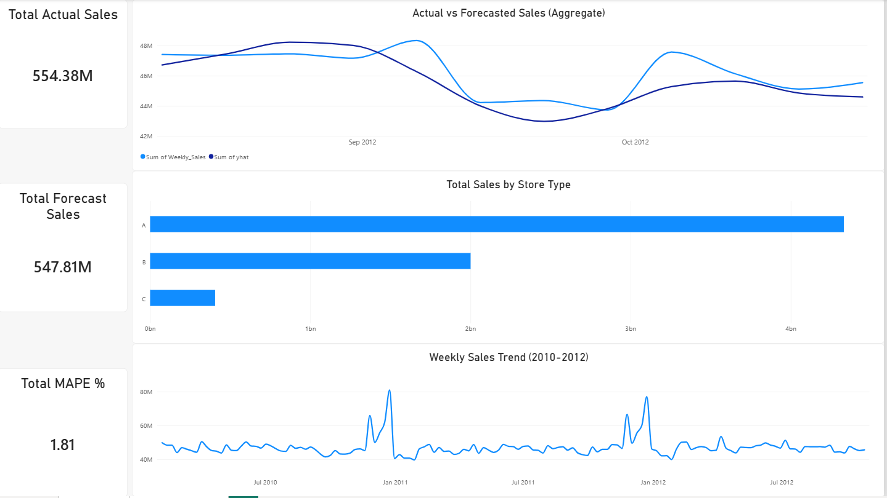

# AI-Augmented Sales Forecasting & Demand Planning

End-to-end demand planning project built on the **Walmart Recruiting - Store Sales Forecasting** dataset (Kaggle). Combines time-series forecasting, a Power BI dashboard, and an AI agent layer that automatically explains forecast performance in plain language.

## Overview

Retail demand planning teams need more than a forecast number — they need to know *how accurate* the forecast is, *where* it breaks down, and *why*. This project builds that full pipeline:

1. Clean and merge multi-source retail data (sales, macroeconomic features, store metadata).
2. Build a time-series forecasting model (Prophet) at two levels — aggregate company-wide and single-store — to demonstrate the accuracy trade-off between granularity levels.
3. Score forecast accuracy using industry-standard metrics (MAPE, WAPE, Bias).
4. Visualize actual vs. forecasted performance in an interactive Power BI dashboard.
5. Use an LLM agent (Groq API) to turn the raw error metrics into a written analyst-style summary with a root-cause hypothesis and an actionable recommendation.

## Dataset

[Walmart Recruiting - Store Sales Forecasting](https://www.kaggle.com/c/walmart-recruiting-store-sales-forecasting/data) (Kaggle), covering 45 stores, ~99 departments, weekly sales from Feb 2010 to Oct 2012 (421,570 rows), plus economic indicators (CPI, unemployment, fuel price) and promotional markdown data.

## Tech Stack

| Layer | Tools |
|---|---|
| Data Cleaning & EDA | Python (Pandas, NumPy, Matplotlib) |
| Forecasting Model | Prophet (time series, yearly seasonality) |
| Accuracy Metrics | MAPE, WAPE, Bias (custom NumPy implementation) |
| Dashboard | Power BI Desktop (DAX measures, dual-page report) |
| AI Analysis Layer | Groq API (`openai/gpt-oss-120b`), prompt-engineered summarization |

## Methodology

### 1. Data Cleaning
- Merged `train`, `features`, and `stores` datasets on `Store`, `Date`, and `IsHoliday`.
- Filled missing `MarkDown` promotional columns with 0 (absence of a promotion, not a missing value).
- Forward-filled missing `CPI` and `Unemployment` values per store (continuous economic indicators).
- Clipped 1,285 negative `Weekly_Sales` values to 0 (returns exceeding sales in a given week).

### 2. Forecasting
- Built a Prophet model on the last 131 weeks of aggregate weekly sales, holding out the final 12 weeks as a test set.
- Repeated the same process for a single mid-volume store to compare forecast accuracy at different levels of granularity.

### 3. Accuracy Results

| Level | MAPE | WAPE | Bias |
|---|---|---|---|
| Aggregate (all stores) | 1.81% | 1.83% | 1.18% |
| Single store (Store 40) | 3.76% | 3.90% | 0.37% |

Accuracy degrades from aggregate to store level — a direct, measurable demonstration of the variance-reduction effect of aggregation, and a key trade-off in real-world demand planning (aggregate forecasts look great on paper; store-level forecasts are what actually drive inventory decisions).

### 4. Power BI Dashboard
Two-page report:
- **Overview**: company-wide actual vs. forecast trend, sales by store type, KPI cards.
  
- **Store Deep-Dive**: Store 40 actual vs. forecast, weekly error detail table, KPI cards.
  !Store Deep-Dive](Outputs/Store 40.png)

### 5. AI Agent Layer
A Python function summarizes the forecast comparison table into a structured prompt, sent to Groq's `openai/gpt-oss-120b` model, which returns a concise write-up covering:
- Overall forecast reliability
- The worst-performing week and a likely root cause
- One actionable recommendation for the demand planning team

Example output:

> *"The forecast for Store 40 was very reliable overall, with an average absolute percentage error of just 3.8% across the 12-week period... The single week that stood out — September 7, 2012 — saw a 13% under-forecast (about 126k units)... Recommendation: Integrate the store's promotional and event calendar into the forecasting process..."*

## Setup Instructions

1. Clone the repository:
   ```bash
   git clone https://github.com/adhamkhafagy/walmart-sales-forecasting.git
   cd walmart-sales-forecasting
   ```
2. Install dependencies:
   ```bash
   pip install -r requirements.txt
   ```
3. Download the dataset from [Kaggle](https://www.kaggle.com/c/walmart-recruiting-store-sales-forecasting/data) and place `train.csv`, `test.csv`, `features.csv`, and `stores.csv` inside a `data/` folder.
4. Create a `.env` file in the project root with your Groq API key (used only for the AI analysis layer):
   ```text
   GROQ_API_KEY=your_key_here
   ```
5. Open the notebooks in `notebooks/` and run them in order (data cleaning → modeling → AI analysis).
6. Open `dashboard/*.pbix` in Power BI Desktop to explore the interactive dashboard.

## Repository Structure

```
walmart-sales-forecasting/
├── data/                  # raw Kaggle CSVs (not included — download separately)
├── notebooks/              # EDA, modeling, and AI agent notebooks
├── outputs/                 # cleaned data and forecast comparison exports for Power BI
├── dashboard/               # Power BI .pbix file
└── README.md
```

## Key Takeaways

- Aggregation improves apparent forecast accuracy but hides the granularity businesses actually need for inventory decisions.
- Pairing a statistical forecasting model with an LLM-generated narrative turns raw error metrics into something a non-technical stakeholder can act on immediately.

## License

This project is licensed under the MIT License — see the [LICENSE](LICENSE) file for details.

## Author

Adham Refaat Soliman — [Portfolio](https://adhamkhafagy.github.io) | [GitHub](https://github.com/adhamkhafagy)
